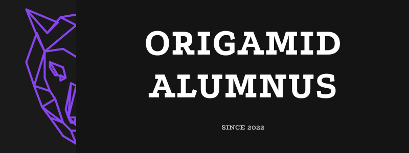

# <b>Origamid - Courses and Projects</b>
Repository of several projects developed during the course at Origamid.
   

<table>
  <thead>
    <tr>
      <th>Courses</th>
      <th>Description</th>
      <th>Projects</th>
    </tr>
  </thead>

  <tbody>
    <tr>
      <td>

      </td>
      </td>
      <td>
        <b>[UI Design For Beginners](https://github.com/LeonardoCCipriano/courses/tree/main/origamid/UIDesignForBeginners)</b> 
        UI Design course for beginners, covers from the beginning to more advanced subjects such as design guides.
        We used the <b>Figma</b> tool to develop 2 layouts, the first being a <b>Portfolio</b> and the second the <b>Bikcraft</b> site.
      </td>
      <td>
        [View More](https://github.com/LeonardoCCipriano/courses/tree/main/origamid/UIDesignForBeginners) 
      </td>
    </tr>
    <tr>
      <td>

      </td>
      <td>
        <b>[UI/UX Design](https://github.com/LeonardoCCipriano/courses/tree/main/origamid/webuiux)</b> 
        Web, UI/UX Design
      </td>
      <td>
        [View More](https://github.com/LeonardoCCipriano/courses/tree/main/origamid/webuiux) 
      </td>
    </tr>
  </tebody>
</table>
